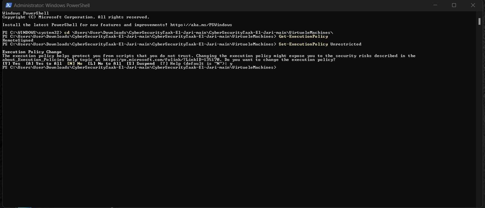
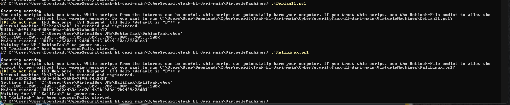

# Startupplan Taak

Dit zijn de stappen die we volgen voor de cybersecurity taak.
We exploiten de CVE-2021-41773

Student 1: El Ihsane
Student 2: Jari Roseleth

## Virtuele Machines opzetten.

### Voorzorgen

#### Files

In ons script zitten de VDI files in een folder op onze \C:\ .

* Debian 11 VDI: `C:\VDI Files\Debian 11 (64bit).vdi`
* KaliLinux VDI: `C:\VDI Files\Kali Linux 2022.3 (64bit).vdi`

#### VDI's

* Download de Debian 11 Desktop (64bit) van https://www.osboxes.org/debian/
* Download de Kali Linux 2022.3 (All Tools) (64bit) van https://www.osboxes.org/kali-linux/

### Powershell 

* Open een Powershell terminal op de plaats van de `Debian11.ps1` en `KaliLinux.ps1`

* Verander de execution policy met `Set-ExecutionPolicy Unrestricted`

* Run daarna de twee scripts één voor één met `.\Debian11.ps1` en `.\KaliLinux.ps1`

  Als de VM al ooit opgezet werd, en we willen hem opnieuw opzetten, dan moeten we de VM eerst verwijderen (delete all files) en de aangemaakte vdi in de media manager ook.

